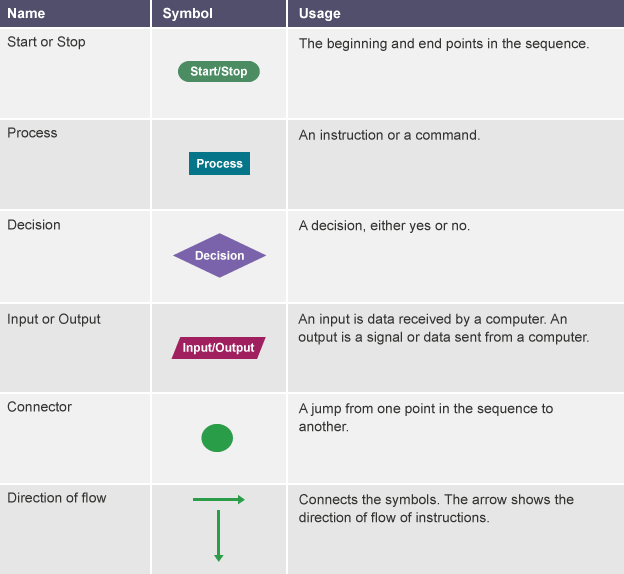
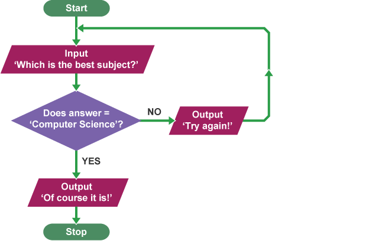

# Flow diagrams

A **flow diagram** (also known as a **flowchart**) is a diagram that represents a set of 
instructions. **Flow diagrams** normally use standard symbols to represent the different types of instructions. These symbols are used to construct the flow diagram and show the step-by-step solution to the problem.

---

## Common flow diagram symbols

---
## Using flow diagrams

**Flow diagrams** can be used to plan out programs. Planning a program that asks people what the best subject they take is, would look like this as a **flow diagram**:

---
